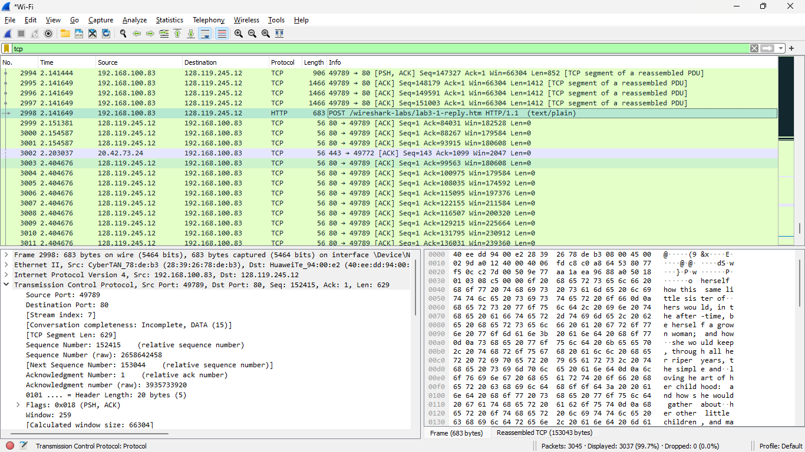
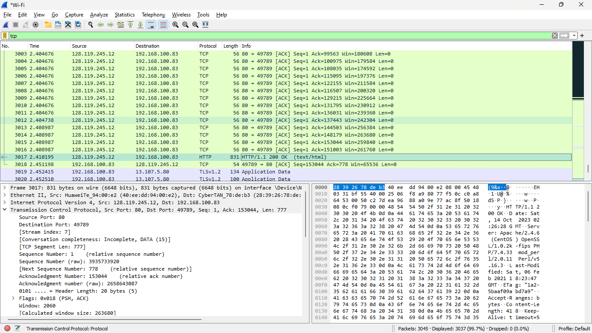
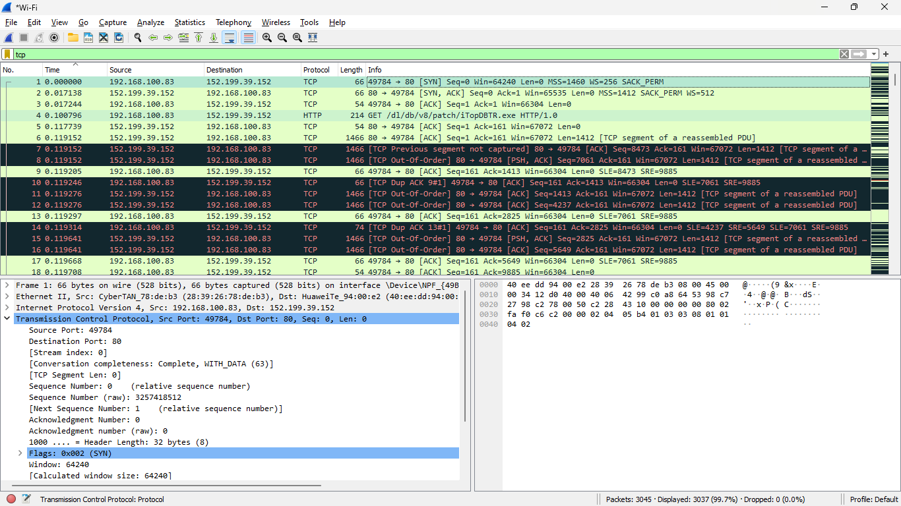
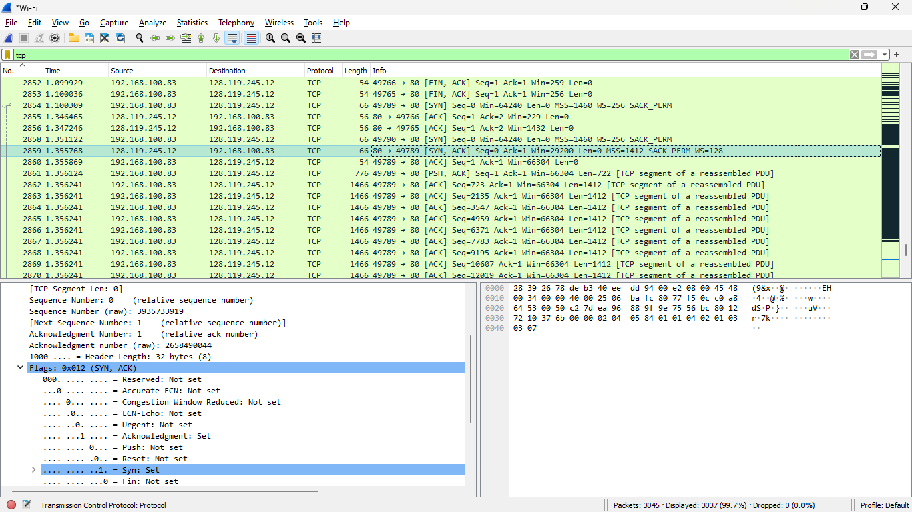
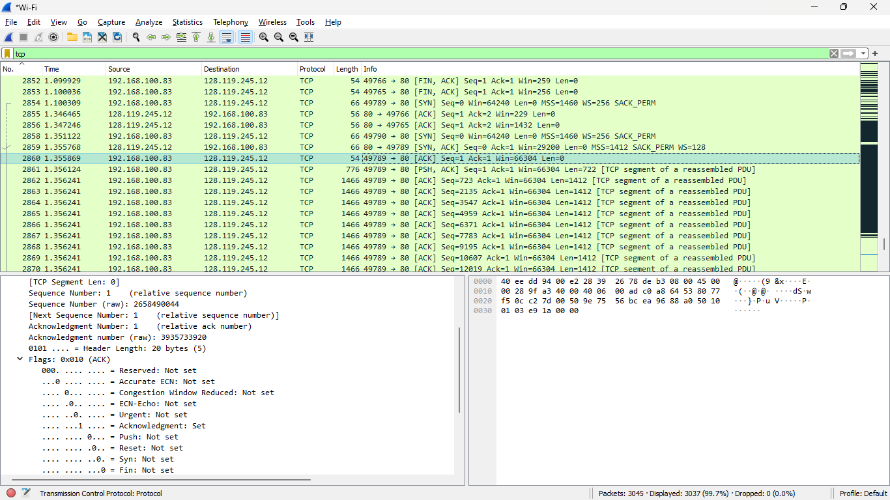
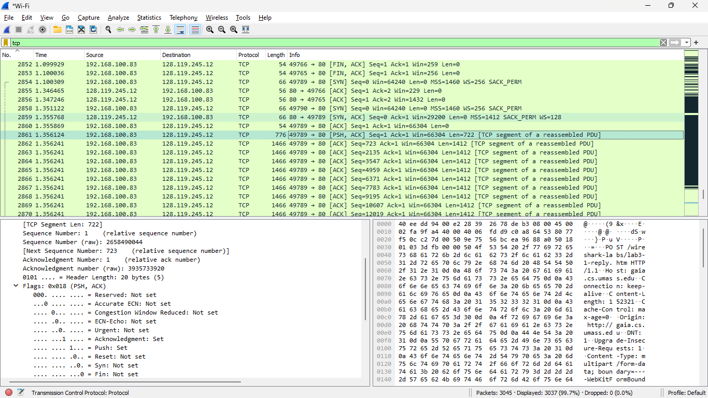
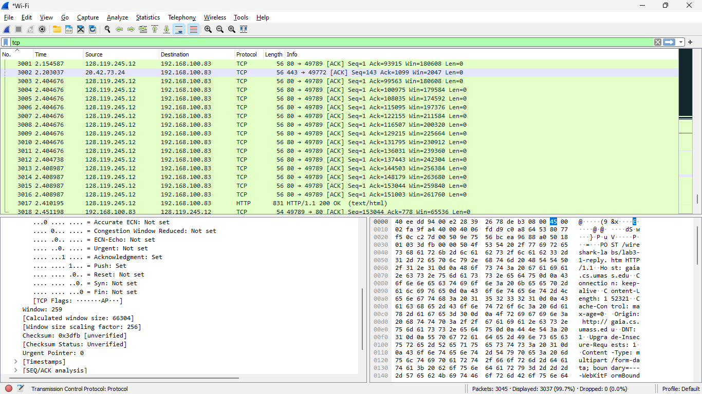

# jarkom TCP

menuliskan query
```
tcp
```


dari gambar ip addres 192.168.100.83	dan mempunyai port 49789



dari gambar ip addres 128.119.245.12 dan mempunyai port 80



untuk sequence number di gambar
dan jika flag syn set berarti sudah syn



untuk sequence number di gambar



untuk ack value synack sama dengan sequence number dari ack segment selanjutnya
flag dari syn dan ack sudah ter set



nilai sequence number sama dengan ack

waktu dari post 1.356124
waktu dari data pertama ack 1.356241

untuk RTT sendiri RTT = Receive Time - Sent Time

untuk data pertama hanya 722 length
sedangkan data selanjutnya memiliki 1412 length

Minimum buffer memiliki nilai 66304
tidak ada throttle karena lebih besar daripada segment length 

tidak memerlukan retransmitted segments in the trace file karena sequence number meningkat tanpa perulangan

data yang diterima 1412 bytes


data awal 1
data akhir 151003
total data = 151003 - 1 = 151002

waktu segment pertama 1.356124
waktu segment terakhir 2.408987
perbedaan = 2.408987 - 1.356124 = 1.052863

throughput = 151002/1.052863 = 143420.369032 bytes/s
