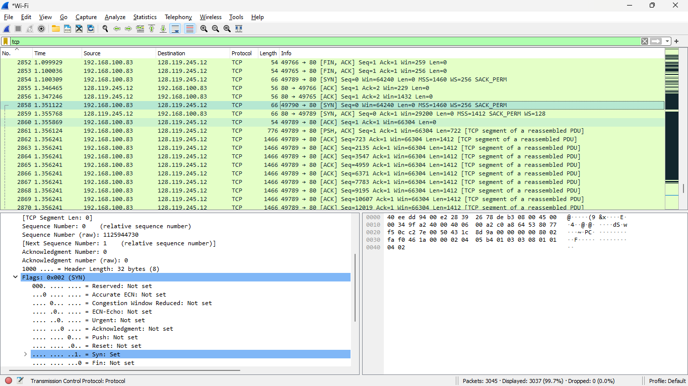

# jarkom

menuliskan query
```
tcp
```


dari gambar ip addres 192.168.100.83	dan mempunyai port 49789


dari gambar ip addres 128.119.245.12 dan mempunyai port 80



untuk sequence number di gambar
dan jika flag syn set berarti sudah syn


untuk sequence number di gambar


untuk ack value synack sama dengan sequence number dari ack segment selanjutnya
flag dari syn dan ack sudah ter set


nilai sequence number sama dengan ack
